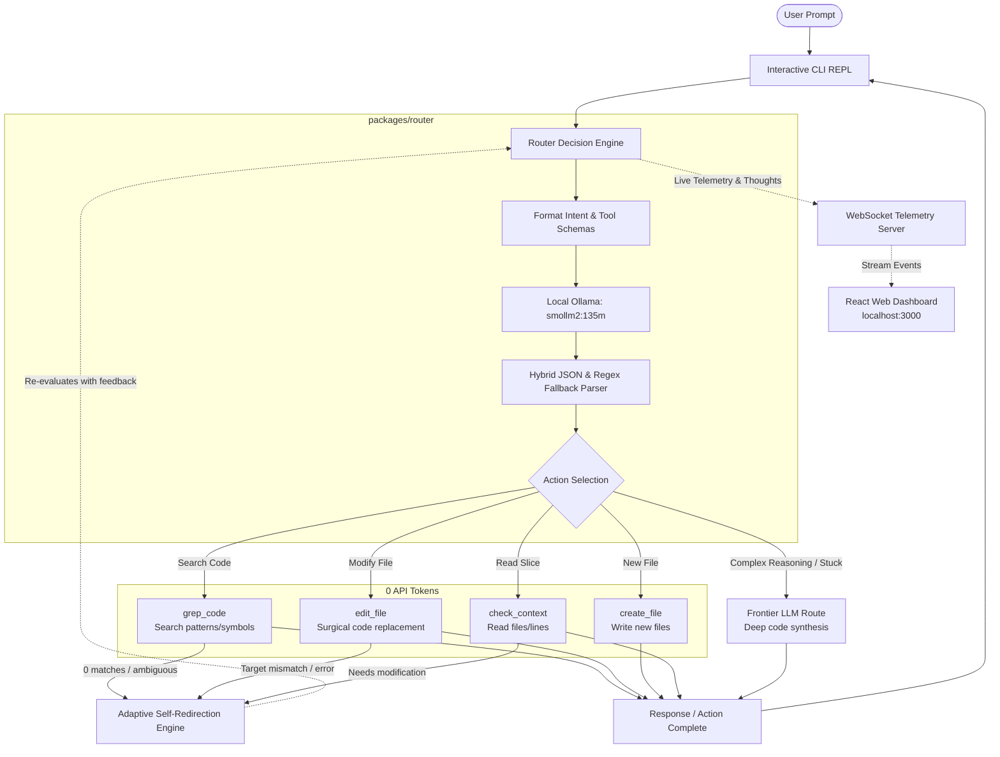

# jev-router-ai

> **An ultra-lightweight, token-saving workspace action router and decision layer for LLM agents.**

`jev-router-ai` is an autonomous decision router engineered to drastically slash LLM token consumption and latency during codebase operations. Instead of piping massive file trees, grep outputs, and routine workspace edits into expensive, slow frontier models, `jev-router-ai` deploys an ultra-fast local decision model (Ollama `smollm2:135m` in development, TypeSafe AI's **Jev** in production) to analyze user intent and choose the exact local action to take.

The router decides when to **grep code**, **inspect file context**, **edit files**, **create files**, or **escalate to a frontier model**, autonomously redirecting its own actions if a search or edit fails—all while streaming its internal thought process live to an interactive CLI and a real-time React dashboard.

---

## 🚀 Key Highlights

* **Local Workspace Decision Engine:** A tiny local model (`smollm2:135m` or Jev) decides whether to `grep`, inspect context, edit, or create files—eliminating thousands of frontier tokens wasted on basic workspace discovery.
* **Massive Token & Cost Savings:** Routine exploration and surgical file modifications run entirely locally at **0 API token cost**, reserving heavy frontier LLMs exclusively for complex multi-file reasoning.
* **Autonomous Action Self-Redirection:** If a `grep` yields no matches, or an `edit_file` target string fails to match, the router catches the result, self-redirects, and selects a corrective follow-up action (e.g., broader search, context re-inspection, or model escalation) without stalling or bothering the user.
* **Real-Time Reasoning Stream:** Streams the router's internal rationale, chosen actions, tool parameters, and redirection loops live to both terminal logs and a real-time web UI over WebSockets.
* **Dual Interface (CLI + Live React Dashboard):** Execute prompts interactively in the terminal while observing real-time decision trees, cumulative tokens saved, and routing latencies on `localhost:3000`.
* **Resilient Parsing for Micro-LLMs:** Employs a hybrid JSON schema parser with regex fallback so even ultra-compact 135M models reliably output structured tool calls.
* **Strict npm Workspaces Monorepo:** Clean architectural separation across `packages/router`, `packages/cli`, and `packages/dashboard`.

---

## 🏗️ Architecture & Decision Flow



---

## 🛠️ Local Action Toolset

The local router controls a focused suite of deterministic workspace tools:

| Action Tool | Description | Why It Saves Tokens |
| :--- | :--- | :--- |
| `grep_code` | Searches codebase files for regex patterns, functions, or variable names. | Avoids passing entire project directories or file lists to a frontier model. |
| `check_context` | Reads targeted line ranges or specific file slices. | Only reads the exact lines needed, preventing context-window bloat. |
| `edit_file` | Applies surgical text or block replacements in existing files. | Performs mechanical code updates locally without full-file generation costs. |
| `create_file` | Generates a new file with specified initial content. | Creates boilerplate, configurations, or new modules directly. |
| `escalate` | Dispatches task to frontier LLM (e.g. Claude / GPT). | Reserved for multi-file architectural refactors or complex algorithmic generation. |

### How Self-Redirection Works in Practice
1. **User Prompt:** *"Find where the user authentication token is verified and add expiration checking."*
2. **Step 1 (Grep):** Small LLM decides: `grep_code { pattern: "verifyToken" }`.
3. **Execution & Feedback:** Tool returns `0 matches found`.
4. **Self-Redirection:** Instead of failing, the router intercepts the empty output. The small LLM re-evaluates:
   * *Rationale:* *"Direct pattern verifyToken yielded 0 matches. Let's inspect auth middleware files."*
   * *Action:* `grep_code { pattern: "auth" }` or `check_context { path: "src/middleware/auth.ts" }`.
5. **Step 2 (Context Inspection):** Router reads lines 10–40 of `src/middleware/auth.ts`.
6. **Step 3 (Edit):** Router dispatches `edit_file` to add the expiration check.
7. **Total Tokens Burned on Frontier LLM:** **0 tokens** (all handled locally via the router and local tools).

---

## 📊 Real-Time React Dashboard

The embedded HTTP server and WebSocket broadcaster stream live analytics to a React dashboard:

* **Live Decision Pipeline:** Step-by-step interactive timeline showing prompt ingress, local LLM rationale, tool dispatch (`grep`, `context`, `edit`), tool output, and redirection cycles.
* **Token Savings Scoreboard:** Real-time calculator comparing local execution (0 API tokens) against what a frontier model would have consumed for the same prompt context and tool loops.
* **Action Distribution Chart:** Pie/bar visualizer tracking frequencies of `grep_code`, `check_context`, `edit_file`, `create_file`, and `escalate`.
* **Latency Telemetry:** Execution speed broken down by router decision time vs. tool execution time.

---

## 📁 Repository Structure

The project is structured as a strict npm workspaces monorepo:

```
jev-router-ai/
├── packages/
│   ├── router/          # Core routing engine & local workspace tools
│   │   ├── src/
│   │   │   ├── engine.ts         # Ollama client (smollm2:135m) & prompt templates
│   │   │   ├── parser.ts         # Hybrid JSON & regex fallback parser
│   │   │   ├── tools/            # Local workspace tools:
│   │   │   │   ├── grep.ts       # Codebase regex & pattern search
│   │   │   │   ├── context.ts    # File slice reader & line inspector
│   │   │   │   ├── edit.ts       # Surgical file content replacer
│   │   │   │   └── create.ts     # New file creator
│   │   │   ├── redirector.ts     # Self-redirection state machine & feedback loop
│   │   │   └── types.ts          # Tool interfaces, events, and action payloads
│   │   └── package.json
│   │
│   ├── cli/             # Interactive terminal REPL & WebSocket telemetry server
│   │   ├── src/
│   │   │   ├── index.ts          # CLI REPL entry point
│   │   │   ├── server.ts         # HTTP & WebSocket server for dashboard
│   │   │   └── terminal.ts       # Live terminal thought & action formatter
│   │   └── package.json
│   │
│   └── dashboard/       # Real-time React frontend (Vite + WebSockets)
│       ├── src/
│       │   ├── App.tsx           # Dashboard root
│       │   ├── components/       # Decision trace, token savings counter, tool charts
│       │   └── hooks/            # WebSocket subscription hook
│       ├── index.html
│       ├── vite.config.ts
│       └── package.json
│
├── package.json         # Monorepo root with npm workspaces configuration
├── tsconfig.json        # Base TypeScript compiler configuration
└── README.md
```

---

## 🛠️ Prerequisites & Setup

### 1. Prerequisites
* **Node.js**: v18.0.0 or higher
* **npm**: v9.0.0 or higher
* **Ollama**: Installed and running locally ([ollama.ai](https://ollama.ai))

### 2. Pull the Local Routing Model
In development, `jev-router-ai` uses the ultra-compact `smollm2:135m` model:

```bash
ollama run smollm2:135m
```

### 3. Install Dependencies
From the repository root:

```bash
npm install
```

### 4. Build All Workspaces
```bash
npm run build
```

---

## 💻 Usage

### Start Interactive CLI + Web Dashboard
Run the combined development environment:

```bash
npm run dev
```

This starts:
1. **Interactive CLI REPL** in your terminal:
   ```text
   [jev-router-ai] Router initialized with Ollama (smollm2:135m).
   [jev-router-ai] Telemetry server running at http://localhost:3000
   
   > Enter prompt: 
   ```
2. **Real-time Web Dashboard** at `http://localhost:3000`.

### Example CLI Session
```text
> Enter prompt: Find where jwt is validated and check if secret is hardcoded

[Router Thinking] User wants to inspect JWT validation. Initiating code search to locate relevant lines.
[Action Dispatched] grep_code: { "pattern": "jwt.verify" }
[Tool Output] Found 1 match in src/auth/jwt.ts:24

[Self-Redirection] Need surrounding context around line 24 to check secret usage.
[Action Dispatched] check_context: { "path": "src/auth/jwt.ts", "startLine": 15, "endLine": 35 }
[Tool Output] Read 20 lines. Secret is passed via process.env.JWT_SECRET.

[Router Result] The JWT verification is in src/auth/jwt.ts at line 24. The secret is securely read from process.env.JWT_SECRET and is not hardcoded.
[Telemetry] Decision Hops: 2 | Latency: 84ms | Frontier Tokens Burned: 0 | Saved: ~1,450 tokens
```

---

## 🗺️ Roadmap & Milestones

- [x] **Milestone 1: Architectural Definition & Requirements**
  - Define local workspace action toolset (`grep_code`, `check_context`, `edit_file`, `create_file`).
  - Specify adaptive self-redirection feedback loop.
  - Setup npm workspaces monorepo structure.
- [ ] **Milestone 2: Core Router Engine & Tools (`packages/router`)**
  - Implement Ollama client with `smollm2:135m`.
  - Build local workspace tool implementations (`grep`, `context`, `edit`, `create`).
  - Build hybrid JSON schema parser with regex fallback.
  - Implement self-redirection state machine to handle empty results / tool errors.
- [ ] **Milestone 3: Interactive CLI & Telemetry Server (`packages/cli`)**
  - Interactive terminal REPL with live streaming of router reasoning and tool actions.
  - Integrated HTTP & WebSocket server broadcasting telemetry events.
- [ ] **Milestone 4: Real-Time React Dashboard (`packages/dashboard`)**
  - Vite + React telemetry dashboard with live WebSocket listener.
  - Real-time decision pipeline timeline, tokens saved counter, and tool distribution charts.
- [ ] **Milestone 5: Production Target — Jev Integration**
  - Swap local Ollama with TypeSafe AI's **Jev** System One decision model.
  - Benchmark sub-100ms deterministic classification and production-scale workspace routing.

---

## 📄 License

MIT
