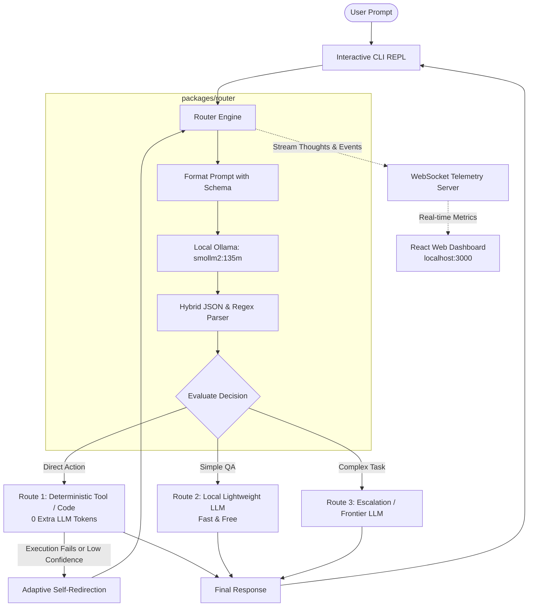

# jev-router-ai

> **An ultra-lightweight, token-saving decision layer and adaptive self-redirecting router for LLMs.**

`jev-router-ai` is an intelligent decision router designed to slash LLM inference costs and latency. Instead of blindly sending every user request to expensive, slow frontier models, `jev-router-ai` acts as a fast decision gateway. It evaluates incoming prompts using a lightweight local model, selects the most efficient execution path, autonomously redirects itself if an action fails or needs escalation, and broadcasts its real-time "thinking process" and metrics to both an interactive CLI and a live React dashboard.

---

## 🚀 Key Highlights

* **Token & Cost Optimization:** Routes simple queries to deterministic local tools (0 extra tokens) or small models, reserving high-cost frontier models only when necessary.
* **Adaptive Self-Redirection:** If a chosen action or tool encounters an error or returns low confidence, the router catches the output and autonomously redirects itself to an escalation route or fallback model without requiring user intervention.
* **Transparent Reasoning Stream:** Streams the router's internal rationale, confidence scores, and action dispatches in real-time to both terminal and web interfaces.
* **Dual Interface (CLI + Live Web Dashboard):** Run queries through an interactive terminal REPL while simultaneously monitoring live decision trees, latency, and tokens saved on a real-time React web application over WebSockets.
* **Resilient Parsing for Micro-LLMs:** Uses a hybrid JSON extraction engine with regex fallback, enabling reliable structured decisions even on ultra-compact models like `smollm2:135m`.
* **Clean Monorepo Architecture:** Built with strict npm workspaces separating the core router, CLI runner, and web dashboard.

---

## 🏗️ Architecture & Decision Flow



---

## ⚡ Tri-Route Execution Model

Out of the box, `jev-router-ai` comes configured with a tri-route strategy:

| Route | Target | Purpose | Token Cost |
| :--- | :--- | :--- | :--- |
| **Route 1: Direct Tool / Code** | Deterministic functions (calculators, lookups, scripts) | Instant resolution of deterministic tasks without touching an LLM | **0 tokens** |
| **Route 2: Local Model** | Fast local LLM | Conversational handling, simple Q&A, basic text summarization | **$0.00 / Zero API cost** |
| **Route 3: Escalation Route** | Frontier model / Deep reasoning | Multi-step reasoning, complex code generation, or fallback when tools fail | **Targeted use only** |

### Adaptive Self-Redirection in Action
1. The user asks: *"Calculate the quarterly projection from the remote sales sheet."*
2. The router selects **Route 1 (Sales API Tool)**.
3. The tool returns: `404: Endpoint unreachable / Missing authentication`.
4. Instead of bubbling an error back to the user, the router **redirects itself**, analyzes the failure, and re-routes the task with contextual feedback to **Route 3 (Escalation / Frontier LLM)** to generate an alternative estimation approach.
5. All intermediate reasoning hops and redirection events are emitted live to the dashboard and terminal.

---

## 📊 Real-Time React Dashboard

The project includes a built-in local HTTP server and WebSocket broadcaster powering a live React dashboard:

* **Live Decision Trace:** Visual step-by-step pipeline displaying incoming prompts, router rationale, chosen actions, and redirection hops.
* **Cumulative Tokens Saved:** Estimated token counter comparing tokens used versus sending all requests directly to a frontier baseline model.
* **Routing Latency:** Real-time millisecond latency tracking for classification and action execution.
* **Route Distribution:** Interactive charts showing breakdown between deterministic tools, local LLM, and escalation routes.

---

## 📁 Repository Structure

The project is structured as a strict npm workspaces monorepo:

```
jev-router-ai/
├── packages/
│   ├── router/          # Core routing logic, decision parser, self-redirection & Ollama integration
│   │   ├── src/
│   │   │   ├── engine.ts        # Ollama client & prompt formatting
│   │   │   ├── parser.ts        # Hybrid JSON / regex fallback extraction
│   │   │   ├── routes.ts        # Route definitions & tool registry
│   │   │   ├── redirector.ts    # Self-redirection state machine
│   │   │   └── types.ts         # Shared TypeScript interfaces
│   │   └── package.json
│   │
│   ├── cli/             # Interactive terminal REPL & WebSocket telemetry server
│   │   ├── src/
│   │   │   ├── index.ts         # CLI entry point (interactive REPL)
│   │   │   ├── server.ts        # HTTP & WebSocket server for dashboard
│   │   │   └── ui.ts            # Terminal formatting & thought streaming
│   │   └── package.json
│   │
│   └── dashboard/       # Real-time React frontend (Vite + WebSockets)
│       ├── src/
│       │   ├── App.tsx          # Main dashboard view
│       │   ├── components/      # Decision trace timeline, metrics cards, latency charts
│       │   └── hooks/           # WebSocket real-time subscription
│       ├── index.html
│       ├── vite.config.ts
│       └── package.json
│
├── package.json         # Monorepo root with npm workspaces configuration
├── tsconfig.json        # Base TypeScript compiler configuration
└── README.md
```

---

## 🛠️ Prerequisites & Setup

### 1. Prerequisites
* **Node.js**: v18.0.0 or higher
* **npm**: v9.0.0 or higher
* **Ollama**: Installed and running locally ([ollama.ai](https://ollama.ai))

### 2. Pull the Local Routing Model
In development, `jev-router-ai` uses the ultra-compact `smollm2:135m` model:

```bash
ollama run smollm2:135m
```

### 3. Install Dependencies
From the repository root:

```bash
npm install
```

### 4. Build All Workspaces
```bash
npm run build
```

---

## 💻 Usage

### Start Interactive CLI + Web Dashboard
Run the combined development command:

```bash
npm run dev
```

This starts:
1. **Interactive CLI REPL** in your terminal:
   ```text
   [jev-router-ai] Router initialized with Ollama (smollm2:135m).
   [jev-router-ai] Telemetry server running at http://localhost:3000
   
   > Enter prompt: 
   ```
2. **Real-time Web Dashboard** at `http://localhost:3000`.

### Example CLI Interaction
```text
> Enter prompt: What is 4829 * 192?

[Router Thinking] Query requires exact arithmetic calculation. Deterministic tool preferred to save tokens.
[Route Selected] Direct Tool: calculator {"expression": "4829 * 192"}
[Execution] 927168
[Result] 927,168
[Stats] Latency: 42ms | Tokens Burned: 0 | Estimated Tokens Saved: 180
```

---

## 🗺️ Roadmap & Milestones

- [x] **Milestone 1: Architectural Definition & Requirements**
  - Clarify self-redirection mechanics and tri-route topology.
  - Design npm workspaces monorepo structure.
  - Document comprehensive system architecture.
- [ ] **Milestone 2: Core Router Engine (`packages/router`)**
  - Implement Ollama integration with `smollm2:135m`.
  - Implement hybrid JSON parser with regex fallback.
  - Implement adaptive self-redirection loop and error interceptor.
  - Define built-in default tools and fallback routes.
- [ ] **Milestone 3: Interactive CLI & Telemetry Server (`packages/cli`)**
  - Build interactive terminal REPL with live thought streaming.
  - Implement local HTTP server and WebSocket telemetry broadcaster.
- [ ] **Milestone 4: Real-Time React Dashboard (`packages/dashboard`)**
  - Build Vite + React dashboard with WebSocket event listener.
  - Implement live decision trace timeline, tokens saved counter, and latency metrics.
- [ ] **Milestone 5: Production Target — Jev Integration**
  - Integrate **Jev** (TypeSafe AI's System One decision model) as a production provider target.
  - Benchmark sub-100ms deterministic routing and production-grade classification throughput.

---

## 📄 License

MIT
